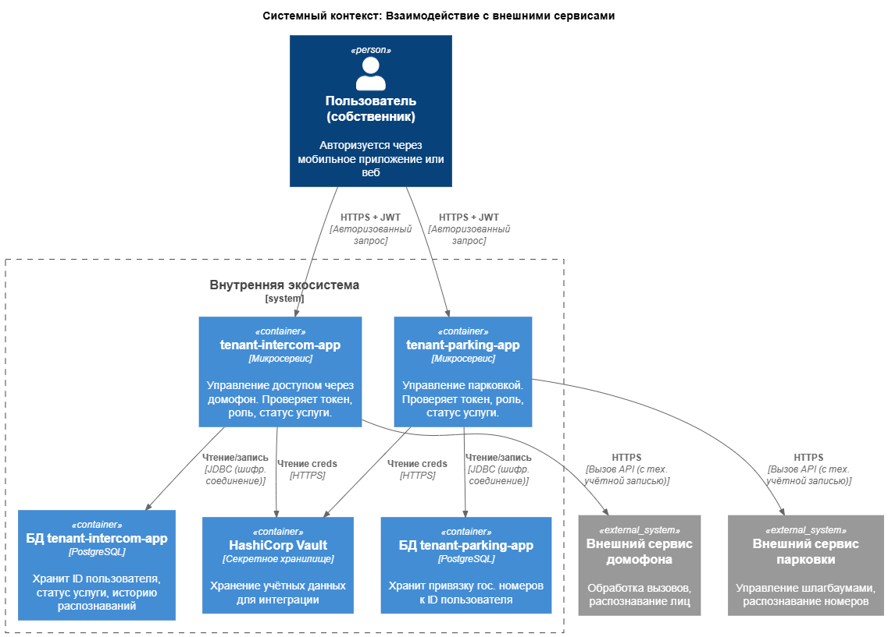

# Список требований

Для организации взаимодействия с внешними сервисами реализованы микросервисы `tenant-parking-app` и `tenant-intercom-app`.

Обмен данными с внешними системами осуществляется по защищённому протоколу **HTTPS**, обеспечивающему шифрование трафика. Доступ к функциональности микросервисов предоставляется только авторизованным пользователям: для идентификации используется токен полученный при входе в мобильное приложение (витрина для собственников) на основе KeyCloak.

Каждый микросервис выполняет следующие проверки:

- **Валидирует ещлут** — подпись и срок действия;
- **Соответствие роли** — доступ разрешён только собственникам жилья;
- **Наличие активной (оплаченной) услуги** - или иной вариант в зависимости от тарифа.

После успешной верификации запросы направляются во внешние сервисы. Авторизация при интеграции с ними выполняется с помощью технологической учётной записи, данные которой хранятся в защищённом хранилище (**HashiCorp Vault**).

## Особенности хранения данных

- Биометрические данные **не сохраняются** в БД микросервиса домофона.
- В `tenant-intercom-app` хранится только:
  - информация о подключённой услуге,
  - история успешных распознаваний (ID пользователя, дата и время).
- В `tenant-parking-app` — привязка гос. номеров ТС к ID пользователя.
- Все данные в базах **зашифрованы** и хранятся в **обезличенном виде**.
- Для аналитики данные передаются через ETL-процессы; выгружается **только агрегированная информация** (например, общее число пользователей сервиса).

## Особенности запросов со стороны провайдеров услуг

Внешние сервисы могут обращаться к нашим сервисам только с "белых" адресов.
Передавать фото-видео данные пользователей в зашифрованном виде.

## Работа с персональными данными

С пользователей должно быть получено согласие на обработку персональных (биометрия) данных.

